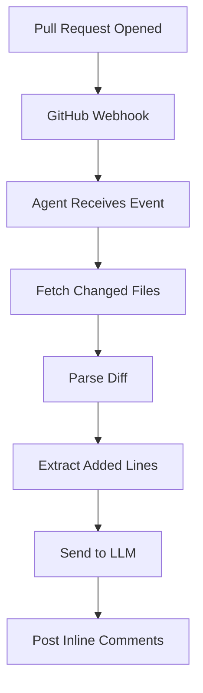

# 🤖 AI PR Review Agent

> Automated AI-powered code review directly on your Pull Requests.

---

## 🚀 Features

- 🔍 Analyzes Pull Requests automatically  
- 💬 Comments **inline on the exact changed lines**  
- 🧠 Detects:
  - bugs  
  - bad practices  
  - performance issues  
- ⚡ Lightweight and low-cost (Groq LLM)  
- 🔗 Seamless GitHub integration via webhooks  

---

## 🧠 How It Works



---

## 🏗️ Project Structure

```bash
src/
├── agent/
│   └── reviewAgent.ts
├── github/
│   ├── webhook.ts
│   ├── processPr.ts
│   └── githubClient.ts
├── analysis/
│   └── patchParser.ts
└── index.ts
```

---

## ⚙️ Getting Started

### 1. Clone

```bash
git clone https://github.com/your-username/refactor-ai-agent.git
cd refactor-ai-agent
```

### 2. Install

```bash
npm install
```

### 3. .env

```env
GITHUB_TOKEN=your_github_token
GROQ_API_KEY=your_groq_api_key
```

### 4. Run

```bash
npm run start
```

---

## 🌐 Ngrok

```bash
ngrok http 3000
```

---

## 🔗 Webhook

- URL: `/webhook`
- Event: Pull requests

---

## 💬 Example

```md
🤖 AI Review

Issue: usage of any  
Fix: define a proper type
```

---

## 📦 Stack

- Node.js  
- TypeScript  
- Express  
- Octokit  
- Groq  

---
